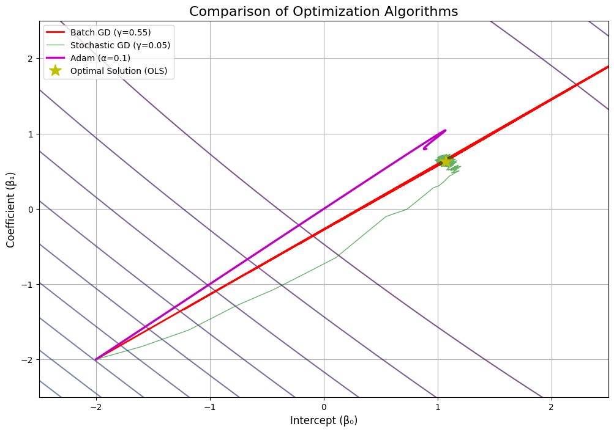

# libor_mathematical_modeling
# A Mathematical Exposition of US LIBOR Rate Dynamics: Linear Modeling and Numerical Optimization

This repository presents a comprehensive data science project analyzing the US LIBOR term structure. The project progresses from foundational data analysis to advanced predictive modeling, culminating in the application of stochastic calculus to price interest rate derivatives. It is designed to demonstrate a rigorous, first-principles approach to the mathematical and computational challenges inherent in quantitative finance.

## Table of Contents
1. [Project Overview](#1-project-overview)
2. [Exploratory Data Analysis & Correlation](#2-exploratory-data-analysis--correlation)
3. [Predictive Modeling with Linear Regression](#3-predictive-modeling-with-linear-regression)
4. [Deep Dive: Gradient Descent Implementation](#4-deep-dive-implementing-gradient-descent-from-scratch)
5. [Advanced Optimization & Regularization](#5-advanced-optimization--regularization)
6. [Dimensionality Reduction with PCA](#6-dimensionality-reduction-with-pca)
7. [Time Series Modeling (ARIMA & GARCH)](#7-time-series-modeling-arima--garch)
8. [Advanced Non-Linear and Stochastic Models](#8-advanced-non-linear-and-stochastic-models)
9. [Conclusion & Future Work](#9-conclusion--future-work)
10. [How to Run This Project](#10-how-to-run-this-project)

---

### 1. Project Overview

This project analyzes historical US LIBOR rates to model the term structure's dynamics. The core objectives are:
- To explore the linear and non-linear relationships between LIBOR tenors.
- To build and validate predictive models using both standard libraries and from-scratch implementations.
- To investigate the limitations of simple models and explore more advanced techniques suitable for financial time series, including time-varying volatility and regime shifts.
- To apply stochastic modeling concepts to a practical financial engineering problem: option pricing.

**Technologies Used:** Python, NumPy, Pandas, Matplotlib, Scikit-Learn, Statsmodels, Arch.

**Dataset:** `swapLiborData.csv`, containing daily US LIBOR and swap rates from 2014 to 2018.

---

### 2. Exploratory Data Analysis & Correlation

The initial analysis revealed a strong positive linear correlation between all LIBOR tenors. The LIBOR yield curve exhibited a significant upward shift and steepening from 2014 to 2018, indicating a rising rate environment.


The correlation matrix confirmed this visual intuition, with all coefficients **> 0.96**. This high degree of co-movement strongly justifies the use of linear models for prediction.


---

### 3. Predictive Modeling with Linear Regression

Using Scikit-Learn, both simple and multiple linear regression models were fitted on data from Jan 2014 to May 2016.

- **Simple Regression (L_6M vs. L_2M):** Achieved an **R² of 0.9660**.
- **Multiple Regression (L_12M vs. L_2M, L_3M, L_6M):** Achieved an improved **R² of 0.9913**.

The models showed excellent in-sample predictive power, closely tracking the actual rate movements.

| Model                                        | Intercept (β₀) | β₁ (L_2M) | β₂ (L_3M) | β₃ (L_6M) | R²     |
| -------------------------------------------- | :------------: | :-------: | :-------: | :-------: | :----: |
| **Simple Linear Regression**                 |     0.0190     |  1.6963   |    -      |    -      | 0.9660 |
| **Multiple Linear Regression**               |     0.2024     |  0.4255   |  -1.6767  |  2.0576   | 0.9913 |


---

### 4. Deep Dive: Implementing Gradient Descent from Scratch

To demonstrate a fundamental understanding of the optimization process, the Gradient Descent algorithm was implemented from first principles to solve the linear regression problem.

#### **MSE Cost Surface and Convergence**
The Mean Squared Error (MSE) cost function was visualized as a contour plot. The path of the GD algorithm was then plotted, demonstrating its iterative convergence towards the optimal solution found by the analytical OLS method.


#### **The Critical Role of the Learning Rate (γ)**
The impact of the learning rate was studied empirically. An improperly chosen γ led to slow convergence (γ=0.01) or divergence (γ=1.0, 1.5), highlighting the key trade-offs in numerical methods. A value of γ=0.55 showed efficient convergence.


---

### 5. Advanced Optimization & Regularization

The optimization analysis was extended to more sophisticated algorithms. **Stochastic Gradient Descent (SGD)** showed a much noisier path, while **Adam** converged significantly faster and more directly than standard Batch GD.


To address multicollinearity, **L1 (Lasso)** and **L2 (Ridge)** regularization were implemented. The regularization paths clearly show Ridge's smooth coefficient shrinkage versus Lasso's ability to perform feature selection by forcing coefficients to exactly zero.


---

### 6. Dimensionality Reduction with PCA

Principal Component Analysis (PCA) was applied to daily LIBOR rate changes to identify the primary drivers of yield curve movements.

#### **Explained Variance**
The first three components explain **~93%** of the total variance, confirming that a few key factors drive the entire term structure.


#### **Principal Components**
The components have clear financial interpretations: **PC1 (Level)**, **PC2 (Slope)**, and **PC3 (Curvature)**.


---

### 7. Time Series Modeling (ARIMA & GARCH)

The limitations of OLS were diagnosed by plotting the Autocorrelation Function (ACF) of the residuals, which revealed significant autocorrelation.



To address this, an **ARIMA(1,1,1)** model was fitted. It provided an excellent in-sample fit and a robust framework for forecasting, correctly handling the time-series nature of the data.


Furthermore, a **GARCH(1,1)** model was fitted to the rate changes to model time-varying volatility. The model successfully captured periods of high and low market turbulence (volatility clustering).


---

### 8. Advanced Non-Linear and Stochastic Models

The potential for non-linear relationships was explored with **Polynomial** and **Kernel Ridge Regression**. Both models improved upon the linear fit, with the non-parametric Kernel model providing the most flexibility.


Finally, continuous-time stochastic models were calibrated to historical data. A key finding was the failure of the **Vasicek** and **CIR** models when calibrated on the full, trending dataset. By calibrating on a more stationary sub-period (2014-2015), sensible parameters were obtained. The subsequent failure of these models to predict the 2016 rate-hike cycle provides a powerful empirical demonstration of **model risk and regime shifts**.


As a final application, the analytical formula for a **European call option** was implemented using the Vasicek model. The sensitivity of the option's price to the short rate and time to expiry was visualized.


---

### 9. Conclusion & Future Work

This project successfully demonstrated a comprehensive workflow for analyzing and modeling financial time series. It progressed from basic linear models to sophisticated non-linear, stochastic, and time-series techniques, validating from-scratch implementations against established libraries. Key insights were drawn regarding model limitations, the importance of hyperparameter tuning, and the underlying mathematical principles of each method.

Future research could extend this work by implementing more advanced optimizers (e.g., Adam), applying multivariate time-series models like VAR, or developing a formal backtesting framework for a trading strategy based on the model forecasts.

---

### 10. How to Run This Project

1.  **Clone the Repository:**
    ```bash
    git clone <your-repo-url>
    cd <your-repo-directory>
    ```

2.  **Set up a Virtual Environment (Recommended):**
    ```bash
    python -m venv venv
    source venv/bin/activate  # On Windows, use `venv\Scripts\activate`
    ```

3.  **Install Dependencies:**
    All required libraries can be installed via pip.
    ```bash
    pip install numpy pandas matplotlib scikit-learn statsmodels arch
    ```

4.  **Launch Jupyter Notebook:**
    ```bash
    jupyter notebook
    ```

5.  **Run the Notebook:**
    Open the `.ipynb` file and execute the cells in order. Ensure the `swapLiborData.csv` file is in the same directory.
